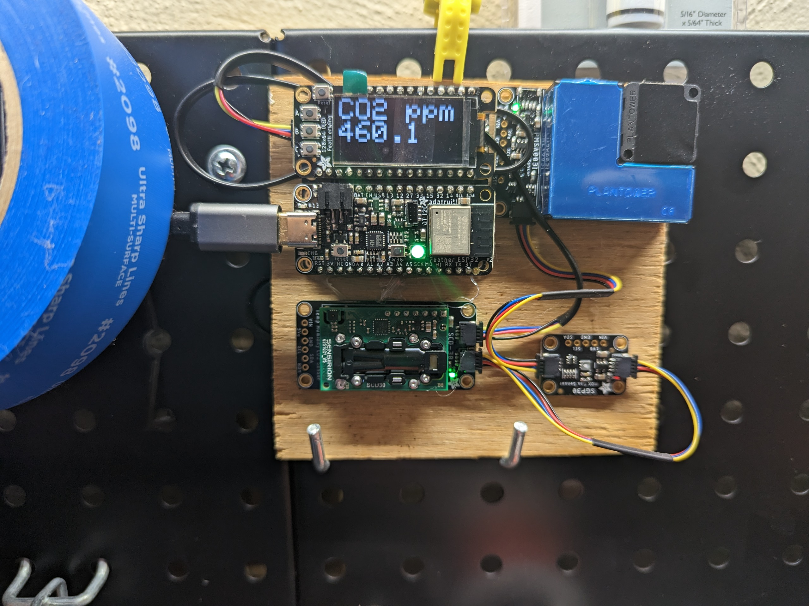

# Construction

I don't have in-progress build photos.

## Components
The base under the upper two boards is an Adafruit FeatherWing Doubler prototyping add-on https://www.adafruit.com/product/2890.

The particulate matter sensor is an Adafruit PMSA003I https://www.adafruit.com/product/4632

The tVOC sensor is an Adafruit SGP30 Air Quality https://www.adafruit.com/product/3709 

The CO2 sensor is an Adafruit SCD-30 - NDIR CO2 Temperature and Humidity Sensor https://www.adafruit.com/product/4867 

The microcontroller is an Adafruit Feather ESP32 Feather V2 https://www.adafruit.com/product/5400 with an on-board neopixel.

These all use the STEMMA QT connector cable and I2C. This allows all the sensors to be daisy chained together. This should work with any wifi-enabled board such as the ESP8266, as long as you have the required connections to pair with the STEMMA QT platform.

To mount the sensors, I hot glued them to a piece of scrap wood and hung it on the pegboard above my workbench.



The total cost was approximately $160.

# The code

The code is not particularly beautiful.
The following libraries are used and need to be installed using the Arduino IDE.

```
Adafruit_GFX.h
Adafruit_SH110X.h
Adafruit_NeoPixel.h
Adafruit_SCD30.h
Adafruit_PM25AQI.h
Adafruit_SGP30.h
```

Lastly, the code will need to be modified if you want to use an API to injest the data. The connection information is in `wifi-details.h`. My API runs on a LetsEncrypt certificate, so the Internet Security Research Group root CA is hardcoded in since the ESP32 does not have a trusted root CA store and wouldn't be able to validate the TLS certificate. My API ingestor is not public, but essentially all it does is act as a translation layer. It takes a post request of parameters and values, and an API key and does further processing to generate visualizations.